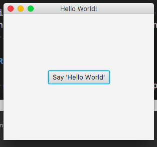

# Nashorn JavaFx: FarJar and Application Packaging/Bundler

This is a prototype project for establishing a re-usable pattern for developing JavaFX applications using Nashorn JS and then building, and packaging that application for multiple native environments (Windows MSI, Mac DMG, etc)

This enables the packaging of a JavaFx application using Nashorn as the primary development language.

The FatJar supports enables you to wrap app application dependencies into a single executable jar for use across operating systems.

More about Nashorn and JavaFX:
1. https://docs.oracle.com/javase/8/docs/technotes/guides/scripting/nashorn/javafx.html
1. https://docs.oracle.com/javase/9/nashorn/nashorn-and-javafx.htm#JSNUG141
1. https://github.com/dasniko/riding-the-nashorn/blob/master/javafx.adoc

# The Launcher (Java Class)

In `src/main/java/io/digitalstate/fxlauncher` there is the Launcher class.  This class generates a Nashorn embedded JS script engine inside of a Javax Application class.  The class boostraps the JavaFX environment and dependencies for use by the Nashorn engine.

This setup is required because the `-fx` Nashorn engine argument does not function when used in a embedded environment; it appears to only function in a `jjs` use case.

The launcher also enables ES6 support for Nashorn using the `--language=es6` in the `nashorn.args` system property.

# Run Local

To get started you can start the application with: `./gradlew clean run`

This will download the dependencies and you will see the application load from the `app/hello.js` script.

When you click on the "Say 'Hello World'" button it will print `Hello World!` in the console

# Generate and Execute Fat Jar:

Build the Fat Jar: `./gradlew clean shadowJar`

The farjar will be in `./build/libs`

Execute Fat Jar: `java -jar /Users/MyUser/javafx-nashorn-demo-0.1.0-fat.jar --entrypoint=app/hello.js`

where `--entrypoint` is the path within the jar to the entrypoint JavaFx nashorn script.  Multiple entry points are supported for enabling multiple applications to be run from a single farjar.

# Research Links and General References:

1. https://github.com/edvin/fxldemo-gradle
1. https://plugins.gradle.org/plugin/no.tornado.fxlauncher
1. https://github.com/edvin/fxlauncher
1. https://github.com/FibreFoX/javafx-gradle-plugin
1. https://docs.oracle.com/javase/8/docs/api/javax/script/ScriptContext.html
1. https://docs.oracle.com/javase/8/docs/api/javax/script/ScriptEngine.html?is-external=true
1. https://github.com/nasven/samples/blob/9b6ca4e59332b3ddd919e8c209f519530b9de495/javafx-dialogs/index.js
1. https://stackoverflow.com/questions/38915158/passing-command-line-switch-to-nashorn-javascript-engine
1. Pattern that Launcher/Loader was based from: https://github.com/reactiverse/es4x/blob/develop/src/main/java/io/reactiverse/es4x/nashorn/Loader.java

# Todo

1. Setup better entrypoint usage
1. Setup packaging for installers on native desktops
1. Setup Launcher class as its own jar that can be donwloaded as a dependency
1. Cleanup Launcher class and optimize for caching
1. Look into how to reference the entry point to a path relative to the install location when using https://github.com/FibreFoX/javafx-gradle-plugin
1. Setup examples for stylesheets and other theme options
1. Setup examples for a more complex UI
1. Look into Vertx integration with EventBus usage
1. Unit Tests for Launcher
1. Review Mobile application deployment scenarios
1. Add es4x loader scripts for enabling NPM Require and CommonJS script loading (https://github.com/reactiverse/es4x)

# VS Code Bug

There is a Java Access Restriction Warning when using VS Code: https://github.com/redhat-developer/vscode-java/issues/120.  This will cause the Launcher class to appear red/un-buildable.  But it will still build.  Follow issue 120 for progress.  The issue is specific to JavaFX usage.